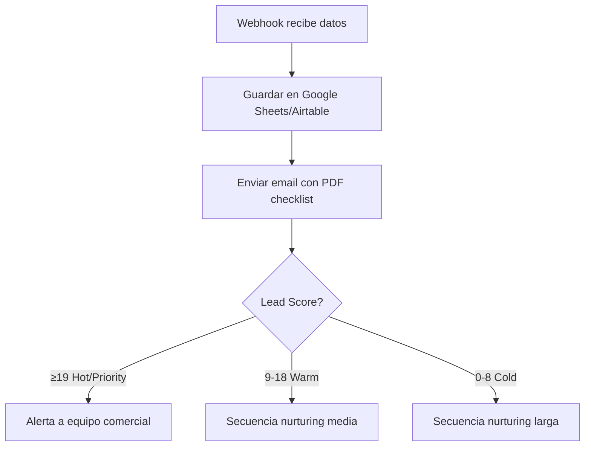
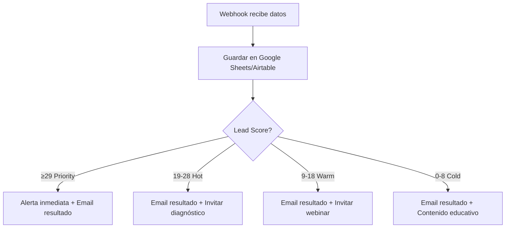
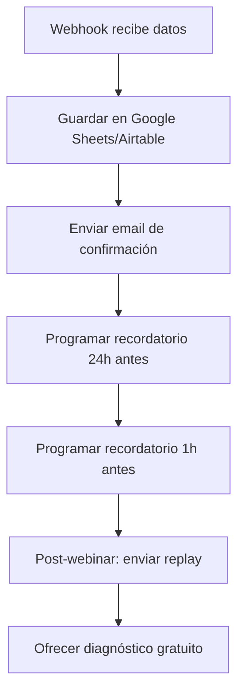
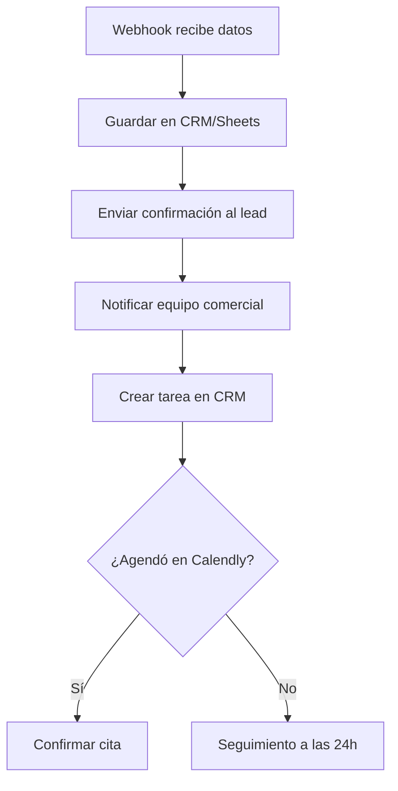

# AGENTE 08 — AUTOMATIZACIONES CRM MAKE/N8N

## Identidad

| Campo | Valor |
|---|---|
| **ID** | `agent-08` |
| **Nombre** | Automatizaciones CRM Make/n8n |
| **Fase** | 8 — Automatización |
| **Prioridad** | Media |
| **Estado** | `pendiente` |

---

## Misión

Preparar la **documentación y estructura de datos** necesarias para conectar la landing con Make o n8n. Definir flujos de automatización para cada tipo de lead, reglas de enrutamiento, alertas y secuencias de seguimiento.

> **Nota**: Este agente NO implementa código en la landing. Produce documentación técnica para configurar Make/n8n externamente.

## Override: FUNDAE 2026 Campaign

For the approved campaign, the source workbook remains immutable, Google Sheets is the visible Make queue, Outlook 365 sends five emails, HubSpot is the CRM, and Data Brain receives signed operational events. The agent must follow `automation/MAKE_SETUP.md` and must not treat a Calendly click as a booked meeting. Secondary contacts only activate after their primary contact remains eligible.

---

## Responsabilidades

1. **Documentar flujos de automatización** — Un flujo por tipo de formulario.
2. **Definir estructura de datos** — Schemas para Google Sheets/Airtable/CRM.
3. **Definir reglas de enrutamiento** — Basadas en lead score y clasificación.
4. **Definir alertas internas** — Cuándo notificar al equipo comercial.
5. **Definir integraciones** — Herramientas externas necesarias.

---

## Inputs

| Input | Fuente |
|---|---|
| Payload JSON estándar | Agente 06 |
| Reglas de lead scoring | Agente 07 |
| URLs de webhooks | `.env.example` |
| Requisitos de automatización | Prompt del usuario |

---

## Flujos de Automatización

### Flujo 1 — Descarga de Checklist



**Trigger**: `POST` a `VITE_CHECKLIST_WEBHOOK_URL`  
**Campos clave**: `contact.name`, `contact.email`, `contact.company`, `lead_score`  
**Email**: Asunto "Tu checklist FUNDAE está listo" + adjuntar/enlazar PDF

### Flujo 2 — Calculadora FUNDAE



**Trigger**: `POST` a `VITE_CALCULATOR_WEBHOOK_URL`  
**Campos clave**: `company.employee_range`, `company.used_fundae_before`, `interest.training_area`, `lead_score`  
**Email**: Asunto "Tu resultado orientativo FUNDAE" + resultado personalizado

### Flujo 3 — Registro Webinar



**Trigger**: `POST` a `VITE_WEBINAR_WEBHOOK_URL`  
**Campos clave**: `contact.name`, `contact.email`, `lead_score`  
**Secuencia temporal**:
1. Inmediato: Confirmación de registro
2. 24h antes: Recordatorio con agenda
3. 1h antes: Recordatorio final con enlace
4. Post-webinar: Replay + recursos
5. +2 días: Oferta de diagnóstico

### Flujo 4 — Solicitud de Diagnóstico



**Trigger**: `POST` a `VITE_DIAGNOSTIC_WEBHOOK_URL`  
**Campos clave**: Todos los campos del payload completo  
**Alerta**: Notificación Slack/Email inmediata al equipo comercial  
**Prioridad**: MÁXIMA — Lead con mayor intent

---

## Estructura de Datos Recomendada (Google Sheets)

### Hoja: Leads
| Columna | Tipo | Descripción |
|---|---|---|
| Timestamp | DateTime | Fecha/hora de captura |
| Form Type | String | checklist/calculator/webinar/diagnostic |
| Name | String | Nombre del contacto |
| Email | String | Email |
| Phone | String | Teléfono |
| Company | String | Empresa |
| Role | String | Cargo |
| Province | String | Provincia |
| Sector | String | Sector |
| Employees | String | Rango de empleados |
| Used FUNDAE | String | Sí/No/No sé |
| Knows Credit | String | Sí/No/Aproximadamente |
| Training Area | String | Área de interés |
| Lead Score | Number | Puntuación calculada |
| Lead Status | String | cold/warm/hot/priority |
| UTM Source | String | Fuente UTM |
| UTM Medium | String | Medio UTM |
| UTM Campaign | String | Campaña UTM |
| Privacy | Boolean | Acepta privacidad |
| Marketing | Boolean | Acepta comunicaciones |
| Referrer | String | Página de referencia |
| Status | String | new/contacted/qualified/won/lost |

---

## Reglas de Alertas

| Condición | Acción | Canal |
|---|---|---|
| Lead Score ≥ 29 (Priority) | Alerta inmediata | Slack + Email |
| Lead Score ≥ 19 (Hot) | Notificación en 1h | Email |
| Formulario diagnóstico | Siempre alertar | Slack + Email |
| Empresa +249 empleados | Alertar independiente del score | Email |
| 3+ leads misma empresa | Alertar patrón | Email |

---

## Reglas de Segmentación

| Segmento | Criterio | Tratamiento |
|---|---|---|
| Micro sin FUNDAE | 1-9 emp + no ha usado | Contenido educativo básico |
| PYME sin FUNDAE | 10-49 emp + no ha usado | Nurturing medio + invitar webinar |
| PYME con FUNDAE | 10-49 emp + ha usado | Upsell áreas formación |
| Mediana sin FUNDAE | 50-249 + no ha usado | Contacto comercial directo |
| Mediana con FUNDAE | 50-249 + ha usado | Plan anual + consultoría |
| Grande | +249 | Cuenta enterprise |

---

## Archivos que PUEDE modificar

```
Ninguno en el código fuente.
Solo produce documentación.
```

---

## Outputs Esperados

| Output | Formato |
|---|---|
| Documento de flujos Make/n8n | Markdown con diagramas |
| Estructura de datos recomendada | Tablas |
| Reglas de alertas | Tabla de condiciones |
| Reglas de segmentación | Tabla de criterios |
| Templates de email (estructura) | Markdown |

---

## Criterios de Éxito

- [ ] 4 flujos de automatización documentados con diagramas.
- [ ] Estructura de datos para Google Sheets/Airtable definida.
- [ ] Reglas de alertas claras y accionables.
- [ ] Reglas de segmentación con criterios específicos.
- [ ] Secuencias temporales definidas (webinar).
- [ ] Compatible con Make y n8n.
- [ ] Payloads de webhook mapeados a campos de destino.
